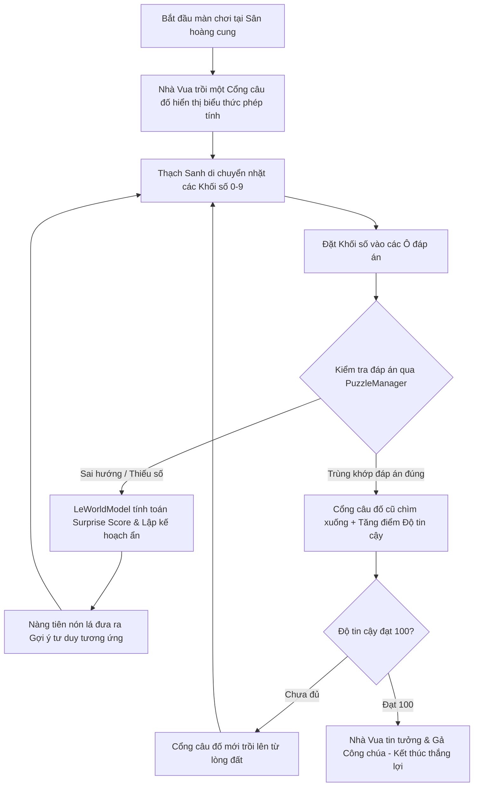

# Bối cảnh Game: Thạch Sanh Giải Đố Hoàng Cung (GMCT_LeWM)

Tài liệu này lưu trữ bối cảnh cốt truyện, luật chơi, thuật ngữ chuyên ngành và luồng tích hợp AI (LeWorldModel) của dự án game 3D giải đố toán học học đường.

---

## 📖 Bối cảnh & Cốt truyện (Lore & Story)

Sau khi giải cứu Công chúa khỏi hang của **Đại bàng tinh**, **Thạch Sanh** tìm đến hoàng cung để chứng minh sự thật và vạch trần kẻ mạo danh Lý Thông. Tuy nhiên, vì diện trang phục giản dị của dân thường ("áo của dân chúng"), **Nhà Vua** sinh nghi và không tin lời chàng. Để thử thách mưu trí và lòng trung thực, Nhà Vua đã thiết lập một chuỗi câu đố toán học hóc búa tại sân hoàng cung. 

Được sự trợ giúp từ một **Nàng tiên nón lá** ẩn danh (AI Buddy), Thạch Sanh phải tìm kiếm các khối chữ số bị phân tán và đặt vào các cổng câu đố cổ kính thời Đại Việt để nâng cao **Độ tin cậy** của Nhà Vua. Khi chứng minh đủ tài trí, Nhà Vua mới tin tưởng gả công chúa cho chàng.

---

## 🗣️ Thuật ngữ Dự án (Language / Glossary)

Dưới đây là các thuật ngữ chuẩn hóa được sử dụng trong toàn bộ codebase và tài liệu thiết kế.

### Nhân vật & Thực thể
* **Thạch Sanh (Player)**: Nhân vật người chơi điều khiển dưới góc nhìn thứ ba (3D). Chàng mặc quần áo dân chúng giản dị, di chuyển quanh sân hoàng cung để nhặt khối số.
  * _Tránh dùng_: Warrior, Hero, Knight.
* **Nhà Vua (The King)**: NPC hoàng gia đứng trên khán đài, người đưa ra thử thách và đánh giá Thạch Sanh qua điểm **Độ tin cậy**.
* **Nàng tiên nón lá / AI Buddy**: Người bạn đồng hành bay lơ lửng sát Thạch Sanh (dựa trên tệp hình ảnh [fairy_non_la.png](file:///f:/_FPT/_PRU/Island/lewn/data/fairy_non_la.png)). Nàng tiên ẩn giấu danh tính, giao tiếp bằng tiếng Việt (xưng hô "tráng sĩ" với Thạch Sanh) và cung cấp các gợi ý gián tiếp để giúp chàng vượt qua thử thách.
  * _Tránh dùng_: Assistant, Helper, Guide.

### Cơ chế Game & Môi trường
* **Sân hoàng cung (Palace Courtyard)**: Môi trường 3D mang phong cách **kiến trúc Đại Việt xưa cổ kính**. Đây là nơi diễn ra trò chơi, nơi chứa các khối số rơi tự do và các cổng câu đố.
* **Khối số (Number Block)**: Các vật thể vật lý (RigidBody3D) mang giá trị chữ số từ `0` đến `9` nằm rải rác trên sân. Thạch Sanh có thể nhấc lên và thả chúng vào các ô đáp án.
  * _Tránh dùng_: Digit, Tile, Box.
* **Cổng câu đố (Puzzle Gate)**: Bức tường đá cổ kính chắn đường đi, hiển thị một phép tính toán học (ví dụ: `2 x 50 = ?`). Khi câu đố được giải đúng, cổng sẽ chìm sâu xuống lòng đất, và một cổng câu đố mới chứa biểu thức tiếp theo sẽ trồi lên.
  * _Tránh dùng_: Door, Firewall, Barrier.
* **Ô đáp án (Answer Slot)**: Các khu vực hình học (Area3D) nằm ngay phía trước cổng câu đố. Khi người chơi thả **Khối số** vào đây, khối số sẽ tự động hút chặt (snap) vào tâm và cập nhật biểu thức.
  * _Tránh dùng_: Input box, Placement slot, Socket.
* **Độ tin cậy (Trust Points)**: Điểm số tích lũy của Thạch Sanh được Nhà Vua công nhận. Mỗi khi giải thành công một cổng câu đố, điểm này sẽ tăng lên. Khi đạt mức tối đa (ví dụ: `100`), màn chơi kết thúc và Thạch Sanh thắng cuộc (Nhà Vua tin tưởng gả công chúa).
  * _Tránh dùng_: Score, Points, Exp.

### Thuật ngữ Trí tuệ Nhân tạo (AI & LeWM)
* **LeWorldModel (LeWM)**: Mô hình thế giới dựa trên kiến trúc JEPA (Joint-Embedding Predictive Architecture) của Yann LeCun. Nó ánh xạ trạng thái vật lý của bàn cờ giải đố thành không gian ẩn (latent space) và dự đoán trạng thái tiếp theo dựa trên hành động đặt/rút khối số.
* **Surprise Score (Độ ngạc nhiên)**: Chỉ số chênh lệch (L2 Loss) giữa biểu diễn không gian ẩn thực tế của game sau bước đi với biểu diễn ẩn được dự đoán bởi LeWM. Chỉ số này vọt cao khi người chơi thực hiện hành động sai hoặc đi ngược hướng logic, kích hoạt lời thoại nhắc nhở của Nàng tiên.
* **Gợi ý tư duy (Conceptual Hint)**: Lời thoại trợ giúp từ Nàng tiên nón lá được suy luận từ thuật toán tìm đường đi ẩn (Latent Planning) hướng đến đáp án đích. Thay vì chỉ trực tiếp chữ số cần đặt, gợi ý sẽ khuyến khích Thạch Sanh suy nghĩ về bản chất toán học (ví dụ: gợi ý về hàng trăm, hàng chục của số 100).

---

## 🔄 Luồng Gameplay cốt lõi (Core Game Loop)

---

## 🛠️ Kiến trúc Kỹ thuật & Tích hợp AI (Technical Integration)

### 1. Phân chia vai trò mã nguồn
* **Godot Client (`res://`)**:
  * [Player.gd](file:///f:/_FPT/_PRU/Island/lewn/scripts/Player.gd): Quản lý di chuyển và cơ chế tương tác vật lý (raycast nhặt/thả khối).
  * [PuzzleManager.gd](file:///f:/_FPT/_PRU/Island/lewn/scripts/PuzzleManager.gd): Đánh giá logic bàn cờ giải đố, cập nhật trạng thái hiển thị cho AI Buddy.
  * [AIBuddy.gd](file:///f:/_FPT/_PRU/Island/lewn/scripts/AIBuddy.gd): Điều khiển chuyển động bay lơ lửng của Nàng tiên nón lá và thay đổi bóng thoại hướng dẫn.
  * [EventLogger.gd](file:///f:/_FPT/_PRU/Island/lewn/globals/EventLogger.gd): Đóng gói dữ liệu tương tác của người chơi dưới dạng JSON.
  * [BackendClient.gd](file:///f:/_FPT/_PRU/Island/lewn/globals/BackendClient.gd): Cầu nối gửi dữ liệu thời gian thực tới FastAPI.

### 2. Mô hình AI (`lewm_poc/`)
* **Học liên tục (Online Continuous Learning)**: Trong quá trình người dùng chơi game, dữ liệu tương tác (sự kiện nhặt thả, đặt sai, giải đúng) từ [EventLogger.gd](file:///f:/_FPT/_PRU/Island/lewn/globals/EventLogger.gd) sẽ được gửi qua [BackendClient.gd](file:///f:/_FPT/_PRU/Island/lewn/globals/BackendClient.gd) lên máy chủ FastAPI chạy ngầm.
* **Huấn luyện & Suy luận (Inference)**: Máy chủ tiếp nhận log để cập nhật trọng số mô hình `lewm_model.pth`. Mô hình sau khi huấn luyện sẽ thực hiện suy luận thời gian thực (inference) để cung cấp Surprise Score và các chỉ dẫn hành động tiếp theo cho Nàng tiên nón lá.

---

## 💬 Ví dụ Đối thoại Minh họa (Example Dialogue)

Đoạn hội thoại mô phỏng giữa một Lập trình viên game (Dev) và Chuyên gia thiết kế màn chơi (Designer) để làm rõ ranh giới các thuật ngữ:

> **Dev**: "Tôi đang cấu hình lại cơ chế nhặt vật thể. Khi **Thạch Sanh** nhặt một **Khối số** từ **Sân hoàng cung**, tôi nên gửi sự kiện gì về backend?"
>
> **Designer**: "Gửi sự kiện `block_grabbed` kèm theo giá trị của khối số đó. Nhớ là chúng ta gọi nó là **Khối số** chứ không phải *Digit* nhé. Ngoài ra, khi khối số đi vào vùng của **Ô đáp án** ngay trước **Cổng câu đố**, ta cần snap nó lại ngay để người chơi thấy rõ chữ số đã được ghi nhận."
>
> **Dev**: "Hiểu rồi. Sau khi xếp đủ các khối số vào các **Ô đáp án**, nếu đáp án sai thì sao?"
>
> **Designer**: "Khi đó, **PuzzleManager** sẽ cập nhật trạng thái bàn cờ. Hệ thống AI backend sẽ tính toán **Surprise Score**. Nếu chỉ số này cao vượt ngưỡng (ví dụ Thạch Sanh đặt nhầm số 9 vào hàng đơn vị thay vì số 0 của đáp án 100), **Nàng tiên nón lá** sẽ kích hoạt **Gợi ý tư duy**. Nàng ấy sẽ nói: *'Tráng sĩ hãy nhìn lại chữ số cuối của đáp án 100 xem sao nhé!'* chứ không nói thẳng là *'Hãy đổi số 9 thành số 0'*."
>
> **Dev**: "Tuyệt vời. Và khi Thạch Sanh sửa lại đúng thành số 100?"
>
> **Designer**: "**Cổng câu đố** hiện tại sẽ chìm dần xuống đất và biến mất. Điểm **Độ tin cậy** của người chơi sẽ được tăng lên, đồng thời một **Cổng câu đố** mới trồi lên để tiếp tục thử thách mưu trí cho đến khi đạt điểm tối đa!"
